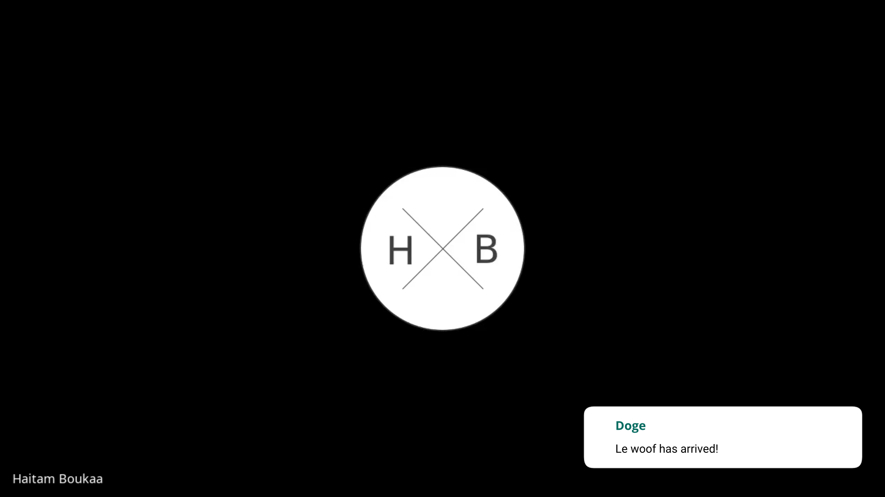

# Google Meet transcript to subtitles converter

When you record a meeting in google meet, you'll see 2 files in your drive folder: the video file and the transcript 
file in `.sbv` format. This is a simple (and messy) script that converts the transcript to a subtitles file in `.ass` format.

### Usage

```sh
node app.js c|convert -i|--input <inputFile> [--output <outputFile>]
```
#### Example
* Input file (transcript.sbv):
```
00:00:20.906,00:00:23.906
Doge: Le woof has arrived!
```
* Command:
```sh
node app.js c -i transcript.sbv
```
A file named `transcript.sbv.css` will be generated. Load the subtitles in your media player while playing the 
meeting video (just drag and drop). Result:



### Limitations
It cannot fit a whole essay in the message toast, only simple short messages, precisely 42 character per line 
with a maximum of 3 lines per message, otherwise, longer messages will be trimmed.
